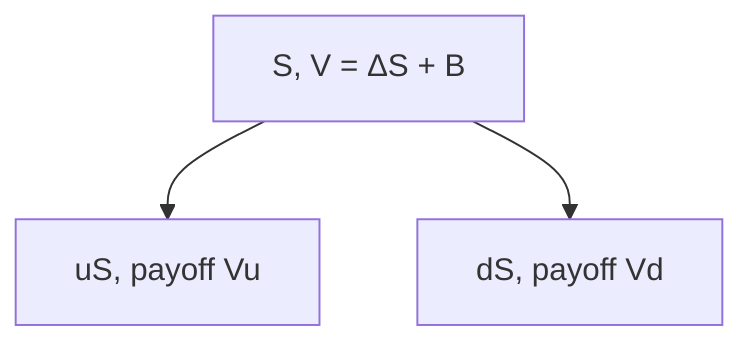

# Binomial trees
{: .no_toc }

*~9 min read*

**Interview occasional**

## Why it matters

The one-step binomial model is the cleanest picture of *why* options have a unique price: you form a replicating portfolio of stock + bond that matches both the up and down payoffs, so the option must cost the same as that portfolio. Multi-step trees are how you actually price American options and other early-exercise features. Interviewers use a one-step tree to test replication; they rarely want you to code a 100-step CRR tree on a whiteboard.

## Core concepts

- **Setup (one step).** Stock \(S \to uS\) or \(dS\). Option payoff \(V_u, V_d\). Build \(\Delta\) shares and amount \(B\) in the money-market so that \(\Delta\, uS + B e^{r h} = V_u\) and \(\Delta\, dS + B e^{r h} = V_d\). Two equations, two unknowns. Option value today is \(\Delta S + B\).
- **Delta is the hedge ratio:** \(\Delta = (V_u - V_d)/(S(u-d))\). This is the discrete version of BS delta.
- **Risk-neutral probability.** Solving the same system is equivalent to \(V = e^{-r h}[p^* V_u + (1-p^*) V_d]\) with \(p^* = (e^{(r-q)h} - d)/(u-d)\). \(p^*\) is *not* the real-world probability of up. If \(p^*\) is outside \((0,1)\), the tree admits arbitrage (\(u,d\) don't straddle the forward).
- **Real-world \(p\) never enters the price.** Same reason \(\mu\) drops out of BS: the hedge spans both outcomes, so beliefs don't matter (complete one-step market).
- **Multi-step / CRR.** Cox–Ross–Rubinstein: \(u = e^{\sigma\sqrt{\Delta t}}\), \(d = 1/u\), \(p^*\) from the forward. Recombining tree: after \(n\) steps, \(n+1\) terminal nodes, not \(2^n\). Work **backward** from expiry.
- **American exercise.** At each node, value = \(\max(\text{exercise intrinsic},\; \text{hold} = e^{-rh} E^*[V_{\text{next}}])\). This is the main practical reason trees still exist: BS has no early-exercise, European Monte Carlo doesn't either without extra work.
- **Limit is Black–Scholes.** As \(n\to\infty\) with \(u,d\) calibrated to \(\sigma\), the distribution of \(\log S_T\) becomes lognormal and the price converges to BS (see [Black–Scholes intuition](../05-black-scholes-intuition/)).
- **Trees vs. Monte Carlo vs. PDE.** Trees: low dimension, early exercise, easy to explain. Painful in several underlyings (nodes explode unless you use other grids). Monte Carlo: high dimension, path dependence; early exercise is awkward (see [Monte Carlo pricing](../07-monte-carlo-pricing/)).

## Mental model

Choose \(\Delta, B\) so the portfolio matches \(V_u\) and \(V_d\). Then \(V\) is unique or there is arb. Multi-step: repeat that argument at every node, rolling back to time 0.

## Interview questions

1. **In a one-step tree, why don't you discount the *real-world* expected payoff at a risky rate?**
   Answer: That would mix a belief \(p\) with an ad-hoc risk adjustment. Replication already produces the unique no-arbitrage price, which equals the *risk-neutral* expected payoff discounted at \(r\). Using \(p\) would generally *not* match the replicating cost, and would allow arb against the hedge.

2. **Stock 100, \(u=1.1\), \(d=0.9\), \(r=0\) over the step, call strike 100. Price it.**
   Answer: \(V_u = 10\), \(V_d = 0\). \(\Delta = (10-0)/(110-90) = 0.5\). Borrowing: \(0.5\times 90 + B = 0 \Rightarrow B = -45\). \(V = 0.5\times 100 - 45 = 5\). Equivalently \(p^* = (1-0.9)/(1.1-0.9) = 0.5\), \(V = 0.5\cdot 10 + 0.5\cdot 0 = 5\).

3. **What goes wrong if \(d < e^{(r-q)h} < u\) fails?**
   Answer: Then \(p^* \notin (0,1)\). The forward lies outside \([dS, uS]\), so you can lock a riskless profit with stock vs. cash (the tree itself is an arbitrage, before any option).

4. **Why is a recombining tree important, and when does recombination fail?**
   Answer: \(n\) steps → \(n+1\) nodes instead of \(2^n\). Recombination needs \(ud = du\) (constant factors). State-dependent vol, some path-dependent features, or non-constant \(u,d\) can break it unless you build a different grid (or switch to Monte Carlo).

5. **How do you price an American put on a tree, and why might it exercise early?**
   Answer: At each node take \(\max(K-S,\; \text{continuation})\). A deep-ITM American put can exercise early because the strike is received *now* and can earn interest, while the downside on the stock is bounded — the European put cannot capture that.

## Watch

- [FRM: Binomial (one step) for option price](https://www.youtube.com/watch?v=kml52n2zmQs) — Bionic Turtle. Replicating portfolio on a one-step tree.
- [Introduction to binomial option pricing model: two-step (FRM T4-6)](https://www.youtube.com/watch?v=lzMQ3hZqtp0) — Bionic Turtle. Rolling back two steps, including the idea of a recombining tree.
- [19. Black-Scholes Formula, Risk-neutral Valuation](https://www.youtube.com/watch?v=TnS8kI_KuJc) — MIT 18.S096. One-step binomial as the gateway to risk-neutral pricing and BS.

## Further reading

- Cox, Ross, Rubinstein (1979).
- Hull, chapter on binomial trees (including American options and the matching of \(u,d\) to \(\sigma\)).
