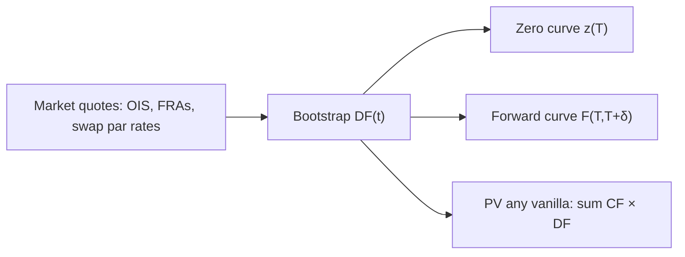

# Interest-rate curves and swaps
{: .no_toc }

*~10 min read*

**🎯 Interview frequent**

## Why it matters

After TVM, the yield curve is the single most important object in rates. A swap is the contract that *defines* a large part of that curve: exchanging fixed vs. floating on a notional that never itself exchanges. Interviewers want you to bootstrap discount factors from liquid instruments, explain par vs. forward vs. zero rates, and describe a vanilla IRS without waving your hands.

## Core concepts

- **Several 'rates' that are not the same.**
  - *Zero / spot rate* \(z(T)\): the YTM of a zero maturing at \(T\). \(DF(T) = e^{-z(T)T}\) (continuous) or \(1/(1+z/m)^{mT}\).
  - *Par rate*: the coupon that makes a vanilla bond (or the fixed leg of a swap) price at par.
  - *Simply compounded forward rate* \(F(t; T, T+\delta)\): the rate, locked at \(t\), for a loan from \(T\) to \(T+\delta\). In a single-curve world, \(F = \frac{1}{\delta}\bigl(DF(T)/DF(T+\delta) - 1\bigr)\).
- **The discount curve is the primitive.** Once you have \(DF(t)\) for all \(t\), every vanilla bond, FRA, and (single-curve) swap is a linear combination of DFs. YTMs and par rates are *quotes*; DFs are what you compute with.
- **Bootstrapping.** Use the most liquid instruments covering successive maturities: deposits / OIS, FRAs or futures, then swaps. Each new instrument solves for the next unknown DF (or a short interpolating segment). Interpolation choice (log-linear on DF, monotonic cubic on forwards, etc.) is a modeling decision, not unique.
- **A vanilla interest-rate swap.** Two legs on the same notional \(N\), no exchange of \(N\):
  - Fixed: pay \(C \times \delta_i \times N\) on a schedule.
  - Floating: pay \(L_{i-1} \times \delta_i \times N\) (LIBOR-legacy) or a compounded overnight (SOFR) over the period.
  At inception a *par swap* has \(C\) set so PV(fixed) = PV(float) \(\approx N(1 - DF(T))\) in the single-curve LIBOR-discounting world. After inception, a receiver swap gains when rates fall (like a long bond).
- **Why swaps exist.** Transform floating-rate debt into synthetic fixed (or vice versa) without refinancing; hedge duration; take a view on the curve. Counterparties originally used comparative advantage in credit markets (Khan Academy's swap videos); today they are a standard risk-transfer tool vs. a dealer/CCP.
- **Single curve vs. multi-curve (post-2008).** You discount on the OIS / SOFR curve (the collateral / funding curve) and project floating legs on their own forward curves (3s, 6s, SOFR, etc.). The 3s-6s basis is a real instrument, not noise. For interviews: *discount on OIS, project on the index the contract actually pays*.
- **Duration of a swap.** A par receiver ≈ long a fixed-rate bond, short a floating-rate bond (near par, low duration). So swap DV01 ≈ DV01 of the fixed leg. Curve *shape* still matters (see [Bonds & duration/convexity](../02-bonds-duration-convexity/)).

## Mental model



```
  Swap (payer of fixed):

  you -- C, C, C, ... C --> counterparty
  you <-- L1, L2, ... Ln -- counterparty
           (notional stays put)

  PV_payer = PV_float - PV_fixed
           = (high when forwards are high)
```

A yield curve is a *snapshot of today's* discount factors by maturity, not a forecast of the path of the short rate (same warning as futures curves).

## Interview questions

1. **Given DFs \(DF(1y)=0.97\), \(DF(2y)=0.94\), what is the 1y1y simply compounded forward (annual)?**
   Answer: \(F = DF(1)/DF(2) - 1 = 0.97/0.94 - 1 \approx 3.19\%\). Intuition: investing 2y vs. rolling 1y then 1y; the forward is the break-even second-year rate.

2. **A 2y annual par swap rate is 4% (single-curve). What is the 2y par bond's coupon, and why?**
   Answer: 4%. In the single-curve world a par swap's fixed leg *is* a par bond minus a floating bond worth par, so the par swap rate equals the par bond coupon. That's why people say "the swap curve is the par curve."

3. **Why, after 2008, do we not discount a SOFR-collateralized swap on a LIBOR curve?**
   Answer: Collateral earns (approximately) the overnight index. Discounting should use the curve consistent with that funding/collateral — OIS/SOFR — not the unsecured 3m LIBOR fixing the *legacy* floating leg projected. Mixing them double-counts credit/funding.

4. **You receive fixed on a 10y par swap, then the whole curve rallies 10bp in parallel. What's the P&L sign, and what's a rough scale?**
   Answer: Rates down → receiver wins (you locked a high fixed). Rough P&L \(\approx + DV01 \times 10\text{bp}\), and DV01 is about that of a 10y par bond on the notional (modified duration ~8–9 years times notional times 0.001). Shape risk remains if the move wasn't parallel.

5. **What's the difference between a forward rate and the future short rate the market 'expects'?**
   Answer: The simply compounded forward is a no-arbitrage rate from DFs. Under risk-neutral (or T-forward) measures it is an expectation of a floating rate; under the real world it generally is not, because of risk premia and convexity (futures vs. forwards). Don't say "the curve is the market's forecast of Fed funds."

## Watch

- [Introduction to the yield curve](https://www.youtube.com/watch?v=b_cAxh44aNQ) — Khan Academy. What "the" Treasury yield curve actually plots.
- [Interest rate swap 1](https://www.youtube.com/watch?v=PLjyj1FJqig) — Khan Academy. Two counterparties exchanging fixed vs. floating on a *notional*.
- [Interest rate swap 2](https://www.youtube.com/watch?v=xE43JrjCpjE) — Khan Academy. After the swap, one party has synthetic fixed-rate debt, the other synthetic floating.

## Further reading

- Hull, chapters on interest rates, FRA/swaps, and (later editions) OIS discounting.
- A standard multi-curve primer (e.g. a dealer research note on SOFR transition) if the seat is rates-heavy.
